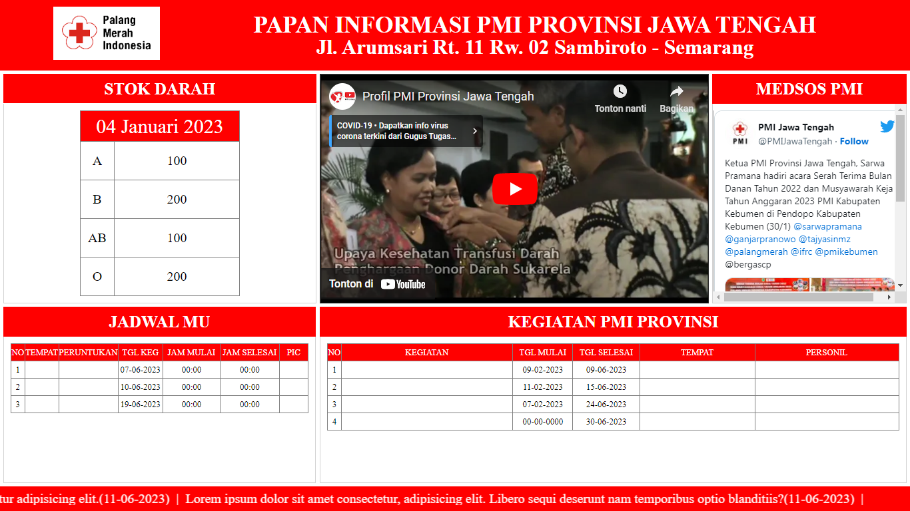

<h2 align="center"> ={ Papan Informasi }=   PMI Provinsi Jawa Tengah </h2>

 
  

<h3 align="center">Deskripsi</h3>

Digital Signage adalah sebuah papan informasi yang menggunakan teknologi digital yang
mampu menampilkan konten dalam bentuk gambar atau video dengan memanfaatkan
teknologi seperti layar LCD, layar LED, wireless presentation, media player, dan lain
sebagainya. Sehingga memungkinkan untuk dapat menyampaikan informasi dengan lebih
eksploratif, dinamis, dan interaktif. 
Papan informasi yang dibuat ini terdiri dari header, stok darah, menampilkan youtube,
menampilkan media sosial, jadwal MU, kegiatan, dan footer yang menggunakan running text. 

<h4 align="center">Menggunakan:</h4>

--=={ HTML | CSS | PHP | MySQL }==--

